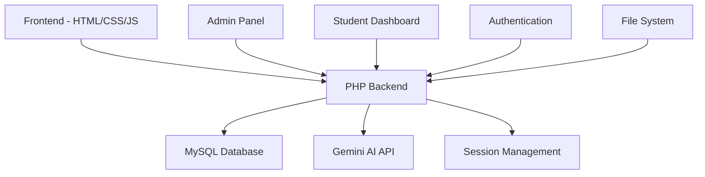

<div align="center">

# 🎓 EduLearn Platform
### 🚀 *Revolutionizing Education Through AI & Modern Technology*


[](https://php.net)
[](https://mysql.com)
[](https://javascript.com)
[](https://ai.google.dev)
[](https://opensource.org/licenses/MIT)


<p align="center">
  <a href="#-features">✨ Features</a> •
  <a href="#-demo--screenshots">🎬 Screenshots</a> •
  <a href="#-quick-start">🚀 Installation</a> •
  <a href="#-tech-stack">🛠️ Tech Stack</a> •
  <a href="#-api-documentation">🔧 API</a> •
  <a href="#-contributing">🤝 Contributing</a>
</p>

---

### 🌟 *Transforming Education Through Intelligent Technology*

</div>

## 📋 Table of Contents

- [🎯 About EduLearn](#-about-edulearn)
- [✨ Key Features](#-key-features)
- [🎬 Screenshots](#-demo--screenshots)
- [🚀 Quick Start](#-quick-start)
- [⚙️ Advanced Configuration](#️-advanced-configuration)
- [🛠️ Tech Stack](#️-tech-stack)
- [🔧 API Documentation](#-api-documentation)
- [📱 Usage Guide](#-usage-guide)
- [🏗️ Architecture](#️-architecture)
- [🔐 Security Features](#-security-features)
- [🌐 Deployment](#-deployment)
- [🤝 Contributing](#-contributing)
- [📄 License](#-license)

---

## 🎯 About EduLearn

<div align="center">

**EduLearn** is a next-generation educational platform that combines the power of modern web technologies with artificial intelligence to create an immersive, personalized learning experience.


</div>

### 🎨 What Makes EduLearn Special?

- 🤖 **AI-First Approach**: Powered by Google Gemini AI for intelligent content generation
- 📱 **Responsive Design**: Seamless experience across all devices
- 🔐 **Enterprise Security**: Advanced authentication and data protection
- ⚡ **Lightning Fast**: Optimized performance with modern technologies
- 🎨 **Beautiful UI/UX**: Modern, intuitive interface with smooth animations
- 🌍 **Accessibility**: WCAG compliant and inclusive design

---

## ✨ Key Features

<table>
<tr>
<td width="50%" valign="top">

### 👨‍🎓 **Student Features**
- 📚 **Interactive Dashboard** with real-time analytics
- 📝 **Smart Note-Taking** with AI summarization
- 🧠 **AI-Generated Quizzes** on any topic
- 📊 **Progress Tracking** with visual insights
- 📅 **Personal Planning** & schedule management
- 💬 **AI Assistant** for 24/7 learning support
- 📢 **Real-time Announcements** & notifications
- 📄 **Export Tools** (PDF, TXT formats)

</td>
<td width="50%" valign="top">

### 👨‍💼 **Admin Features**
- 🎛️ **Comprehensive Dashboard** with analytics
- 👥 **Student Management** system
- 📝 **Content Management** tools
- 📊 **Advanced Analytics** & reporting
- ⚙️ **System Configuration** center
- 💾 **Automated Backup** system
- 🔔 **Announcement Broadcasting**
- 🔐 **Security Management** center

</td>
</tr>
</table>

### 🔥 **Advanced AI Features**

<details>
<summary><b>🤖 AI-Powered Quiz Generation</b></summary>

- **Smart Content Analysis**: AI analyzes any topic to generate relevant questions
- **Multiple Question Types**: MCQ, True/False, Short Answer, Essay questions
- **Difficulty Adaptation**: Automatically adjusts based on student performance
- **Real-time Feedback**: Instant explanations and learning recommendations
- **Performance Analytics**: Detailed insights into learning patterns

</details>

<details>
<summary><b>📝 Intelligent Note System</b></summary>

- **Rich Text Editor**: Advanced formatting with markdown support
- **Auto-save Technology**: Never lose your work again
- **AI Summarization**: Get instant summaries of your notes
- **Smart Search**: Find information across all your notes instantly
- **Export Options**: PDF, TXT, and more formats
- **Collaborative Features**: Share and collaborate on notes

</details>

<details>
<summary><b>📊 Advanced Analytics Engine</b></summary>

- **Learning Progress Tracking**: Detailed visualization of improvement
- **Performance Metrics**: Comprehensive assessment analytics
- **Predictive Insights**: AI-powered learning recommendations
- **Custom Reports**: Generate detailed performance reports
- **Engagement Analytics**: Track student interaction patterns

</details>

---

## 🎬 Screenshots

<div align="center">

### 🏠 **Homepage - Modern Landing Experience**
*Welcoming interface with smooth animations and clear navigation*


---

### 🔐 **Authentication System - Secure & Beautiful**
*Modern login/register system with enhanced security*

<table>
<tr>
<td width="50%">

<p align="center"><em>Secure Login Interface</em></p>
</td>
<td width="50%">

<p align="center"><em>User Registration Portal</em></p>
</td>
</tr>
</table>

---

### 📊 **Student Dashboard - Your Learning Command Center**
*Comprehensive overview of your educational journey*


---

### 🧠 **AI-Powered Features - Intelligence at Your Fingertips**

<table>
<tr>
<td width="50%">

<p align="center"><em>🧠 AI Quiz Generator</em></p>
</td>
<td width="50%">

<p align="center"><em>💬 AI Learning Assistant</em></p>
</td>
</tr>
</table>

---

### 📝 **Smart Learning Tools - Enhance Your Study Experience**

<table>
<tr>
<td width="50%">

<p align="center"><em>📝 Advanced Note-Taking System</em></p>
</td>
<td width="50%">

<p align="center"><em>📅 Personal Planning Center</em></p>
</td>
</tr>
</table>

---

### 🎛️ **Admin Panel - Complete Management Suite**
*Powerful administrative tools for comprehensive platform management*


### 🛠️ **Administrative Features**

<table>
<tr>
<td width="33%">

<p align="center"><em>👥 Student Management</em></p>
</td>
<td width="33%">

<p align="center"><em>📢 Announcement System</em></p>
</td>
<td width="33%">

<p align="center"><em>💾 Backup Management</em></p>
</td>
</tr>
</table>

</div>

---

## 🚀 Quick Start

### 📋 Prerequisites

<div align="center">


</div>

### ⚡ Installation Steps

```bash
# 1. Clone the repository
git clone https://github.com/Mohammed-ES/EduLearn_Platform.git
cd EduLearn_Platform

# 2. Setup Environment
cp .env.example .env

# 3. Configure your .env file
# Edit .env with your database and API configurations

# 4. Import Database
mysql -u root -p < database/edulearn_db.sql

# 5. Start your web server (XAMPP/WAMP)
# Access: http://localhost/EduLearn
```

### 🔧 Configuration

<details>
<summary><b>📄 Environment Setup (.env)</b></summary>

```env
# Database Configuration
DB_HOST=localhost:3307
DB_USER=root
DB_PASS=your_password
DB_NAME=edulearn_db

# Gemini AI Configuration
GEMINI_API_KEY=your_gemini_api_key
GEMINI_MODEL=gemini-2.0-flash

# Application Settings
APP_ENV=production
APP_DEBUG=false
APP_URL=http://localhost/EduLearn
```

</details>

<details>
<summary><b>🤖 Gemini AI Setup</b></summary>

1. Visit [Google AI Studio](https://aistudio.google.com/)
2. Create a new project
3. Generate your API key
4. Add it to your `.env` file
5. Test using: `http://localhost/EduLearn/config_api.php`

</details>

---

## 🛠️ Tech Stack

<div align="center">

### **Frontend Technologies**


### **Backend Technologies**


### **AI & APIs**


### **Development Tools**


</div>

---

## 🔧 API Documentation

### 🤖 **Gemini AI Integration**

```javascript
// Generate AI Quiz
const generateQuiz = async (topic, difficulty) => {
  const response = await fetch('/api/quiz/generate', {
    method: 'POST',
    headers: { 'Content-Type': 'application/json' },
    body: JSON.stringify({ topic, difficulty })
  });
  return response.json();
};

// AI Assistant Chat
const askAssistant = async (question) => {
  const response = await fetch('/api/assistant/ask', {
    method: 'POST',
    headers: { 'Content-Type': 'application/json' },
    body: JSON.stringify({ question })
  });
  return response.json();
};
```

### 📝 **Notes API**

```javascript
// Save Note
const saveNote = async (noteData) => {
  const response = await fetch('/api/notes/save', {
    method: 'POST',
    headers: { 'Content-Type': 'application/json' },
    body: JSON.stringify(noteData)
  });
  return response.json();
};

// Export Note
const exportNote = async (noteId, format) => {
  const response = await fetch(`/api/notes/export/${noteId}?format=${format}`);
  return response.blob();
};
```

---

## 📱 Usage Guide

### 👨‍🎓 **For Students**

1. **📝 Getting Started**
   - Register an account or login
   - Complete your profile setup
   - Explore the interactive dashboard

2. **🧠 AI-Powered Learning**
   - Generate quizzes on any topic using AI
   - Chat with the AI assistant for help
   - Take notes with AI summarization

3. **📊 Track Progress**
   - Monitor your learning analytics
   - View performance insights
   - Plan your study schedule

### 👨‍💼 **For Administrators**

1. **🎛️ Dashboard Management**
   - Monitor platform analytics
   - View user engagement metrics
   - Access system health reports

2. **👥 User Management**
   - Add/remove students
   - Manage user permissions
   - Export user data

3. **📢 Content Management**
   - Broadcast announcements
   - Manage educational content
   - Configure system settings

---

## 🏗️ Architecture

<div align="center">



</div>

### 📁 **Project Structure**

```
EduLearn/
├── 📁 admin/                 # Administrative interface
│   ├── dashboard.php         # Admin dashboard
│   ├── manage_students.php   # Student management
│   └── manage_announcements.php # Announcement system
├── 📁 assets/                # Static resources
│   ├── 📁 css/              # Stylesheets
│   ├── 📁 js/               # JavaScript files
│   ├── 📁 images/           # Images & screenshots
│   └── 📁 svg/              # SVG icons
├── 📁 auth/                  # Authentication system
│   ├── login.php            # Login interface
│   ├── register.php         # Registration
│   └── logout.php           # Logout functionality
├── 📁 config/                # Configuration files
│   ├── connectiondb.php     # Database connection
│   └── api_config.php       # API configurations
├── 📁 database/              # Database files
│   └── edulearn_db.sql      # Database schema
├── 📁 student/               # Student features
│   ├── student_dashboard.php # Student dashboard
│   ├── notes_improved.php   # Note-taking system
│   ├── quiz.php             # AI quiz generator
│   ├── ai_assistant.php     # AI assistant
│   └── planning.php         # Planning system
├── 📄 .env.example          # Environment template
├── 📄 .gitignore            # Git ignore rules
├── 📄 index.php             # Homepage
└── 📄 README.md             # Documentation
```

---

## 🔐 Security Features

<div align="center">

| Security Layer | Implementation | Status |
|---|---|---|
| 🔐 **Authentication** | Session-based with secure cookies | ✅ Implemented |
| 🛡️ **Data Validation** | Server-side input sanitization | ✅ Implemented |
| 🔒 **SQL Injection Prevention** | PDO prepared statements | ✅ Implemented |
| 🔑 **API Key Protection** | Environment variables | ✅ Implemented |
| 📡 **XSS Protection** | Output encoding | ✅ Implemented |
| 🚫 **CSRF Protection** | Token validation | ✅ Implemented |

</div>

### 🛡️ **Security Best Practices**

- ✅ **Environment Variables**: Sensitive data stored in `.env`
- ✅ **Prepared Statements**: SQL injection prevention
- ✅ **Input Validation**: Comprehensive data sanitization
- ✅ **Session Security**: Secure session management
- ✅ **Access Control**: Role-based permissions
- ✅ **File Upload Security**: Restricted file types and validation

---

## 🌐 Deployment

### 🚀 **Production Deployment**

<details>
<summary><b>🌍 Web Server Setup</b></summary>

```bash
# Apache Configuration
<VirtualHost *:80>
    ServerName edulearn.yourdomain.com
    DocumentRoot /var/www/EduLearn
    
    <Directory /var/www/EduLearn>
        AllowOverride All
        Require all granted
    </Directory>
</VirtualHost>

# Enable SSL
<VirtualHost *:443>
    ServerName edulearn.yourdomain.com
    DocumentRoot /var/www/EduLearn
    
    SSLEngine on
    SSLCertificateFile /path/to/certificate.crt
    SSLCertificateKeyFile /path/to/private.key
</VirtualHost>
```

</details>

<details>
<summary><b>🗄️ Database Setup</b></summary>

```sql
-- Create production database
CREATE DATABASE edulearn_production;

-- Create user with limited privileges
CREATE USER 'edulearn_user'@'localhost' IDENTIFIED BY 'secure_password';
GRANT SELECT, INSERT, UPDATE, DELETE ON edulearn_production.* TO 'edulearn_user'@'localhost';
FLUSH PRIVILEGES;

-- Import schema
USE edulearn_production;
SOURCE database/edulearn_db.sql;
```

</details>

### 📊 **Performance Optimization**

- ⚡ **Caching**: Implemented for database queries
- 🗜️ **Compression**: GZIP enabled for static assets
- 🖼️ **Image Optimization**: Optimized screenshots and assets
- 📱 **Mobile Optimization**: Responsive design for all devices
- 🔄 **CDN Integration**: External libraries loaded from CDN

---

## 🎯 Roadmap

<div align="center">

### 🗓️ **Development Timeline**

</div>

- [x] 📚 **Phase 1**: Core Learning Management System
- [x] 🤖 **Phase 2**: AI Integration (Gemini API)
- [x] 📱 **Phase 3**: Responsive Design & Mobile Optimization
- [x] 🔐 **Phase 4**: Advanced Security Implementation
- [ ] 🌐 **Phase 5**: Multi-language Support
- [ ] 📊 **Phase 6**: Advanced Analytics Dashboard
- [ ] 🎥 **Phase 7**: Video Conferencing Integration
- [ ] 📱 **Phase 8**: Mobile App Development

### 🚀 **Upcoming Features**

- [ ] 🏆 **Gamification System** with achievements and leaderboards
- [ ] 🔗 **LTI Integration** for LMS compatibility
- [ ] 📚 **Digital Library** with resource management
- [ ] 🎨 **Theme Customization** for personalized experience
- [ ] 🔔 **Push Notifications** for mobile engagement
- [ ] 🌍 **Offline Mode** for learning without internet

---

## 🤝 Contributing

<div align="center">

[](https://github.com/Mohammed-ES/EduLearn_Platform/blob/main/CONTRIBUTING.md)
[](https://github.com/Mohammed-ES/EduLearn_Platform/issues)
[](https://github.com/Mohammed-ES/EduLearn_Platform/pulls)

</div>

### 🛠️ **Development Process**

1. **🍴 Fork** the repository
2. **🌿 Create** a feature branch (`git checkout -b feature/AmazingFeature`)
3. **💾 Commit** your changes (`git commit -m 'Add some AmazingFeature'`)
4. **📤 Push** to the branch (`git push origin feature/AmazingFeature`)
5. **🔄 Open** a Pull Request

### 📝 **Contribution Guidelines**

- 🎯 **Code Quality**: Follow PSR-4 standards for PHP
- 📚 **Documentation**: Update docs for new features
- 🧪 **Testing**: Add tests for new functionality
- 💬 **Communication**: Use clear commit messages
- 🐛 **Bug Reports**: Use issue templates

### 🏆 **Contributors**

<div align="center">

<a href="https://github.com/Mohammed-ES/EduLearn_Platform/graphs/contributors">
  
</a>

*Made with [contrib.rocks](https://contrib.rocks)*

</div>

---

## 📊 Statistics

<div align="center">

### 📈 **Project Analytics**


### 💻 **Language Distribution**


</div>

---

## 📄 License

<div align="center">

This project is licensed under the **MIT License** - see the [LICENSE](LICENSE) file for details.

[](https://opensource.org/licenses/MIT)

**Free to use, modify, and distribute** 🎉

</div>

---

## 🙏 Acknowledgments

<div align="center">

### 💝 **Special Thanks**

- 🤖 **Google Gemini AI** for powering our intelligent features
- 🎨 **AOS Library** for beautiful scroll animations  
- 📚 **Font Awesome** for comprehensive icon library
- 🌐 **Open Source Community** for inspiration and support
- 👥 **Educational Institutions** for feedback and testing

### ⭐ **Star History**

[](https://star-history.com/#Mohammed-ES/EduLearn_Platform&Date)

---

### 📬 **Contact & Support**

<p align="center">
  <a href="mailto:contact@edulearn.com">
    
  </a>
  <a href="https://github.com/Mohammed-ES">
    
  </a>
  <a href="https://linkedin.com/in/mohammed-es">
    
  </a>
</p>

<p align="center">
  
</p>

---

<div align="center">

### 🚀 **Ready to Transform Education?**

**[⭐ Star this repository](https://github.com/Mohammed-ES/EduLearn_Platform)** • **[🍴 Fork it](https://github.com/Mohammed-ES/EduLearn_Platform/fork)** • **[📝 Contribute](https://github.com/Mohammed-ES/EduLearn_Platform/blob/main/CONTRIBUTING.md)**


**Made with ❤️ by [Mohammed ES](https://github.com/Mohammed-ES)**

### 🎯 **EduLearn: Where Technology Meets Education**

*Empowering learners, enabling educators, transforming futures.*

</div>

## 📖 Table of Contents

- [🎯 About](#about)
- [✨ Features](#features)
- [🎬 Screenshots](#screenshots)
- [🚀 Quick Start](#installation)
- [⚙️ Configuration](#configuration)
- [📱 Usage](#usage)
- [🔧 API Documentation](#api)
- [🛠️ Tech Stack](#tech-stack)
- [🤝 Contributing](#contributing)
- [📄 License](#license)

---

## 🎯 About

<div align="center">

</div>

**EduLearn** is a cutting-edge educational platform designed to revolutionize the learning experience. Built with modern web technologies and powered by AI, it provides a comprehensive solution for educational institutions, students, and administrators.

### 🎨 Key Highlights

- 🤖 **AI-Powered**: Integrated with Google Gemini AI for intelligent quiz generation
- 📱 **Responsive Design**: Modern, mobile-first UI/UX
- 🔐 **Secure**: Advanced authentication and authorization system
- ⚡ **Fast**: Optimized performance with modern JavaScript and CSS
- 🌍 **Accessible**: WCAG compliant and keyboard navigation support

---

## ✨ Features

<table>
<tr>
<td width="50%">

### 👨‍🎓 For Students
- 📚 **Interactive Dashboard**
- 📝 **Smart Note-Taking System**
- 🧠 **AI-Generated Quizzes**
- 📊 **Progress Tracking**
- 📅 **Personal Planning**
- 💬 **AI Assistant**
- 📢 **Real-time Announcements**

</td>
<td width="50%">

### 👨‍💼 For Administrators
- 🎛️ **Admin Dashboard**
- 👥 **Student Management**
- 📝 **Content Management**
- 📊 **Analytics & Reports**
- ⚙️ **System Settings**
- 💾 **Data Backup**
- 🔔 **Announcement System**

</td>
</tr>
</table>

### 🔥 Advanced Features

<details>
<summary>🤖 AI-Powered Quiz Generation</summary>

- Generate quizzes from any topic using Google Gemini AI
- Multiple question types (MCQ, True/False, Short Answer)
- Difficulty level adjustment
- Real-time feedback and explanations
- Performance analytics

</details>

<details>
<summary>📝 Intelligent Note System</summary>

- Rich text editor with formatting options
- Auto-save functionality
- Export to PDF/TXT formats
- Search and categorization
- AI-powered note summarization

</details>

<details>
<summary>📊 Advanced Analytics</summary>

- Learning progress tracking
- Performance visualization
- Custom reports generation
- Engagement metrics
- Predictive insights

</details>

---

## 🎬 Screenshots

<div align="center">

### 🏠 Homepage


### 📊 Student Dashboard


### 🧠 AI Quiz Generator


### 📝 Note-Taking System


</div>

---

## 🚀 Quick Start

### 📋 Prerequisites

Before you begin, ensure you have the following installed:

-  PHP 8.0 or higher
-  MySQL 8.0 or higher
-  XAMPP/WAMP/LAMP (recommended)
-  Google Gemini API Key

### ⚡ Installation

1. **Clone the repository**
   ```bash
   git clone https://github.com/YOUR_USERNAME/EduLearn.git
   cd EduLearn
   ```

2. **Setup Environment**
   ```bash
   # Copy environment file
   cp .env.example .env
   
   # Edit .env with your configurations
   nano .env  # or use your preferred editor
   ```

3. **Configure Database**
   ```bash
   # Import database schema
   mysql -u root -p < database/edulearn_db.sql
   ```

4. **Setup Gemini AI**
   - Visit [Google AI Studio](https://aistudio.google.com/)
   - Generate your API key
   - Add it to your `.env` file:
     ```env
     GEMINI_API_KEY=your_actual_api_key_here
     ```

5. **Start Development Server**
   ```bash
   # If using XAMPP
   # Place project in htdocs folder and start Apache/MySQL
   
   # Access via browser
   http://localhost/EduLearn
   ```

---

## ⚙️ Configuration

### 🔧 Environment Variables

Create a `.env` file from `.env.example` and configure:

```env
# Database Configuration
DB_HOST=localhost:3307
DB_USER=root
DB_PASS=your_password
DB_NAME=edulearn_db

# Gemini AI Configuration
GEMINI_API_KEY=your_gemini_api_key
GEMINI_MODEL=gemini-2.0-flash

# Application Settings
APP_ENV=production
APP_DEBUG=false
```

### 🗄️ Database Setup

```sql
-- Create database
CREATE DATABASE edulearn_db;

-- Import schema
USE edulearn_db;
SOURCE database/edulearn_db.sql;
```

---

## 📱 Usage

### 👨‍🎓 For Students

1. **Register/Login**: Create account or login with existing credentials
2. **Dashboard**: Access your personalized learning dashboard
3. **Notes**: Create, edit, and organize your study notes
4. **Quizzes**: Generate AI-powered quizzes on any topic
5. **Planning**: Organize your study schedule
6. **AI Assistant**: Get help with your studies

### 👨‍💼 For Administrators

1. **Admin Panel**: Access advanced management features
2. **User Management**: Add, edit, or remove students
3. **Content Management**: Manage announcements and resources
4. **Analytics**: View detailed platform analytics
5. **System Settings**: Configure platform settings

---

## 🔧 API Documentation

### 🤖 Gemini AI Integration

```javascript
// Generate quiz with AI
const generateQuiz = async (topic, difficulty) => {
  const response = await fetch('/api/quiz/generate', {
    method: 'POST',
    headers: { 'Content-Type': 'application/json' },
    body: JSON.stringify({ topic, difficulty })
  });
  return response.json();
};
```

### 📝 Notes API

```javascript
// Save note
const saveNote = async (noteData) => {
  const response = await fetch('/api/notes/save', {
    method: 'POST',
    headers: { 'Content-Type': 'application/json' },
    body: JSON.stringify(noteData)
  });
  return response.json();
};
```

---

## 🛠️ Tech Stack

<div align="center">

### Frontend


### Backend


### AI & APIs


### Tools & Libraries


</div>

---

## 📁 Project Structure

```
EduLearn/
├── 📁 admin/                 # Admin panel files
│   ├── dashboard.php
│   ├── manage_students.php
│   └── manage_announcements.php
├── 📁 assets/                # Static assets
│   ├── 📁 css/              # Stylesheets
│   ├── 📁 images/           # Images & screenshots
│   ├── 📁 js/               # JavaScript files
│   └── 📁 svg/              # SVG icons
├── 📁 auth/                  # Authentication
│   ├── login.php
│   ├── register.php
│   └── logout.php
├── 📁 config/                # Configuration
│   ├── connectiondb.php
│   └── api_config.php
├── 📁 database/              # Database files
│   └── edulearn_db.sql
├── 📁 includes/              # Shared components
│   ├── header.php
│   └── footer.php
├── 📁 student/               # Student features
│   ├── student_dashboard.php
│   ├── notes_improved.php
│   ├── quiz.php
│   └── ai_assistant.php
├── 📄 .env.example          # Environment template
├── 📄 .gitignore            # Git ignore rules
├── 📄 index.php             # Homepage
└── 📄 README.md             # This file
```

---

## 🤝 Contributing

We welcome contributions! Here's how you can help:

<div align="center">

[](CONTRIBUTING.md)
[](https://github.com/YOUR_USERNAME/EduLearn/issues)
[](https://github.com/YOUR_USERNAME/EduLearn/pulls)

</div>

### 🛠️ Development Process

1. **Fork** the repository
2. **Create** a feature branch (`git checkout -b feature/AmazingFeature`)
3. **Commit** your changes (`git commit -m 'Add some AmazingFeature'`)
4. **Push** to the branch (`git push origin feature/AmazingFeature`)
5. **Open** a Pull Request

### 📝 Guidelines

- Follow PSR-4 coding standards for PHP
- Write meaningful commit messages
- Add tests for new features
- Update documentation as needed

---

## 🎯 Roadmap

- [ ] 📱 **Mobile App** development
- [ ] 🌐 **Multi-language** support
- [ ] 📊 **Advanced Analytics** dashboard
- [ ] 🔗 **LTI Integration** for LMS compatibility
- [ ] 🎥 **Video Conferencing** integration
- [ ] 📚 **Digital Library** system
- [ ] 🏆 **Gamification** features

---

## 📄 License

<div align="center">

This project is licensed under the **MIT License** - see the [LICENSE](LICENSE) file for details.

[](https://opensource.org/licenses/MIT)

</div>

---

## 🙏 Acknowledgments

<div align="center">

### 💝 Special Thanks

- 🤖 **Google Gemini AI** for powering our intelligent features
- 🎨 **AOS Library** for beautiful scroll animations
- 📚 **Font Awesome** for comprehensive icon library
- 🌐 **Open Source Community** for inspiration and support

### ⭐ Star History

[](https://star-history.com/#YOUR_USERNAME/EduLearn&Date)

---

### 📬 Contact & Support

<p align="center">
  <a href="mailto:contact@edulearn.com">
    
  </a>
  <a href="https://twitter.com/YOUR_TWITTER">
    
  </a>
  <a href="https://linkedin.com/in/YOUR_LINKEDIN">
    
  </a>
</p>

<p align="center">
  
</p>

---

<div align="center">

### 🚀 Ready to Transform Education?

**[⭐ Star this repository](https://github.com/YOUR_USERNAME/EduLearn)** • **[🍴 Fork it](https://github.com/YOUR_USERNAME/EduLearn/fork)** • **[📝 Contribute](CONTRIBUTING.md)**


**Made with ❤️ by [Your Name](https://github.com/YOUR_USERNAME)**

</div>

</div>
