<div align="center">

# 🎓 EduLearn Platform
### 🚀 *Plateforme d'apprentissage moderne alimentée par l'IA*


[](https://php.net)
[](https://mysql.com)
[](https://javascript.com)
[](https://ai.google.dev)

---

### 🌟 *Transformer l'éducation grâce à une technologie intelligente*

</div>

## 📋 À propos d'EduLearn

**EduLearn** est une plateforme éducative de nouvelle génération qui combine la puissance des technologies web modernes avec l'intelligence artificielle pour créer une expérience d'apprentissage immersive et personnalisée.

### 🎨 Ce qui rend EduLearn spécial

- 🤖 **Alimenté par l'IA** : Propulsé par Google Gemini AI pour la génération intelligente de contenu
- 📱 **Design Responsive** : Expérience fluide sur tous les appareils
- 🔐 **Sécurité Avancée** : Authentification et protection des données de niveau entreprise
- ⚡ **Ultra-rapide** : Performance optimisée avec les technologies modernes
- 🎨 **Interface Beautiful** : Interface moderne et intuitive avec animations fluides

---

## ✨ Fonctionnalités Principales

<table>
<tr>
<td width="50%" valign="top">

### 👨‍🎓 **Pour les Étudiants**
- 📚 **Tableau de bord interactif** avec analyses en temps réel
- 📝 **Prise de notes intelligente** avec résumé IA
- 🧠 **Quiz générés par IA** sur n'importe quel sujet
- 📊 **Suivi des progrès** avec insights visuels
- 📅 **Planification personnelle** et gestion d'horaires
- 💬 **Assistant IA** pour support d'apprentissage 24/7
- 📄 **Outils d'export** (formats PDF, TXT)

</td>
<td width="50%" valign="top">

### 👨‍💼 **Pour les Administrateurs**
- 🎛️ **Tableau de bord complet** avec analytics
- 👥 **Gestion des étudiants** système
- 📝 **Gestion de contenu** outils
- 📊 **Analytics avancés** et rapports
- ⚙️ **Centre de configuration** système
- 💾 **Système de sauvegarde** automatisé
- 🔔 **Diffusion d'annonces**
- 🔐 **Centre de gestion sécurité**

</td>
</tr>
</table>

---

## 🎬 Captures d'écran

### 🏠 **Page d'accueil - Expérience d'accueil moderne**
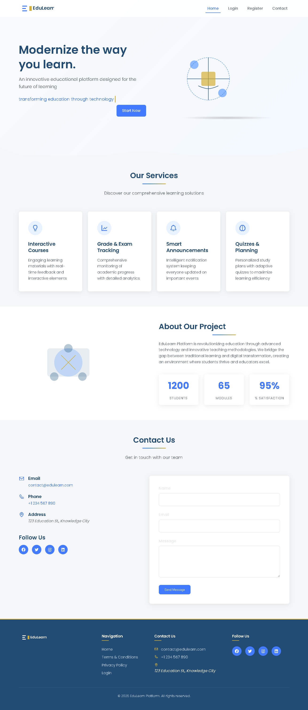

### 🔐 **Système d'authentification - Sécurisé & Moderne**
<table>
<tr>
<td width="50%">
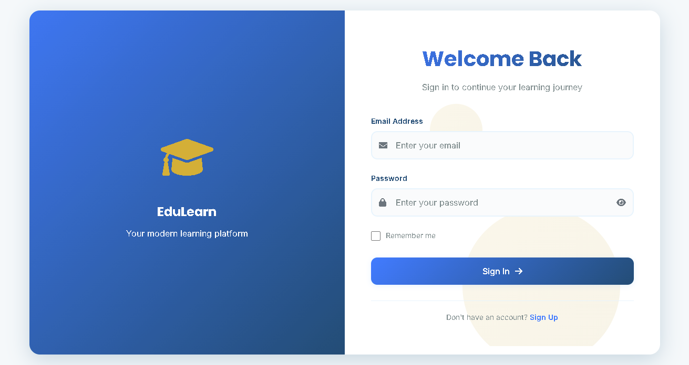
<p align="center"><em>Interface de connexion sécurisée</em></p>
</td>
<td width="50%">
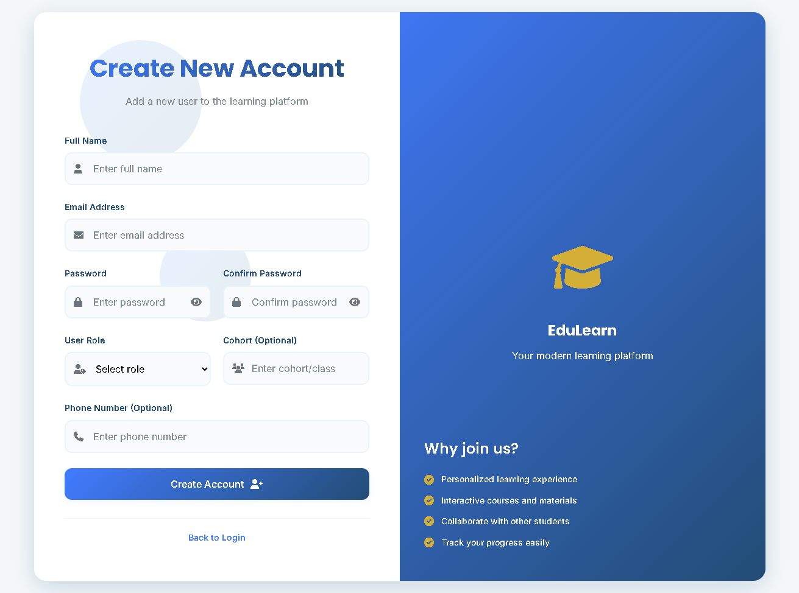
<p align="center"><em>Portail d'inscription utilisateur</em></p>
</td>
</tr>
</table>

### 📊 **Tableau de bord étudiant - Centre de commande d'apprentissage**
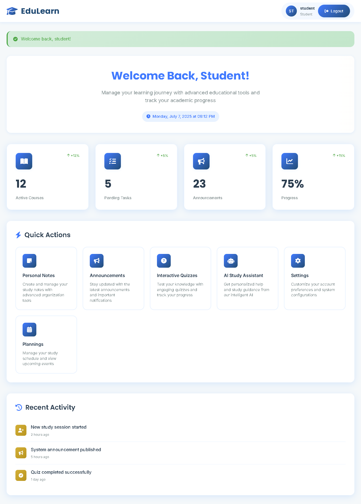

### 🧠 **Fonctionnalités IA - Intelligence à portée de main**
<table>
<tr>
<td width="50%">
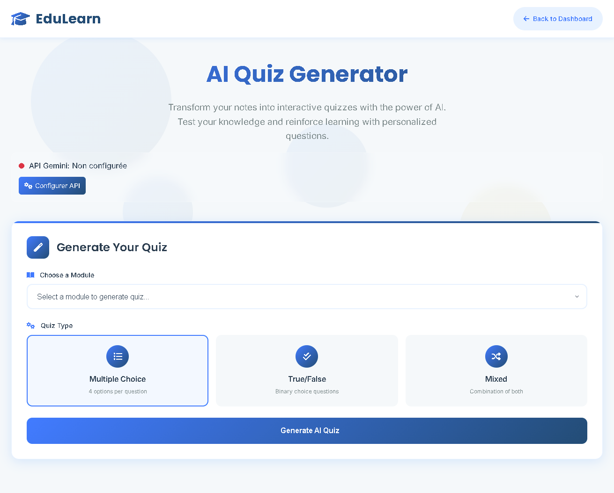
<p align="center"><em>🧠 Générateur de Quiz IA</em></p>
</td>
<td width="50%">
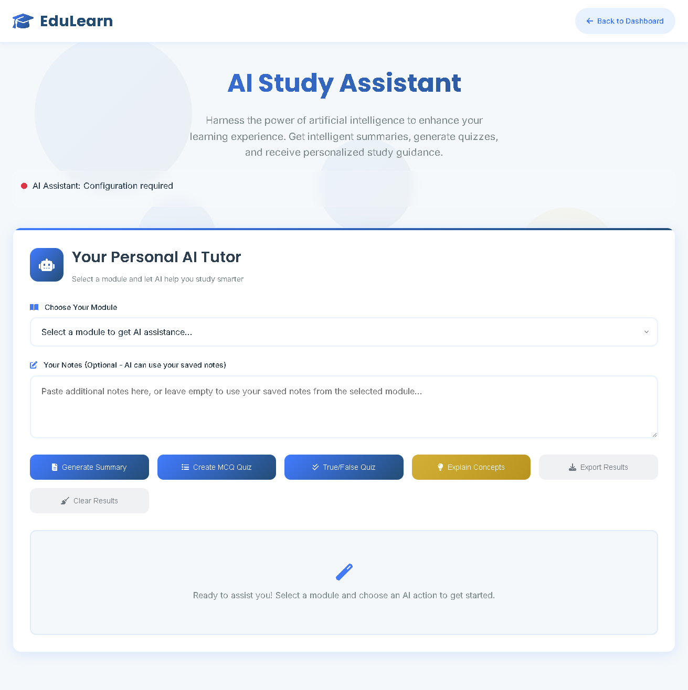
<p align="center"><em>💬 Assistant d'apprentissage IA</em></p>
</td>
</tr>
</table>

### 📝 **Outils d'apprentissage intelligents - Améliorez votre expérience d'étude**
<table>
<tr>
<td width="50%">
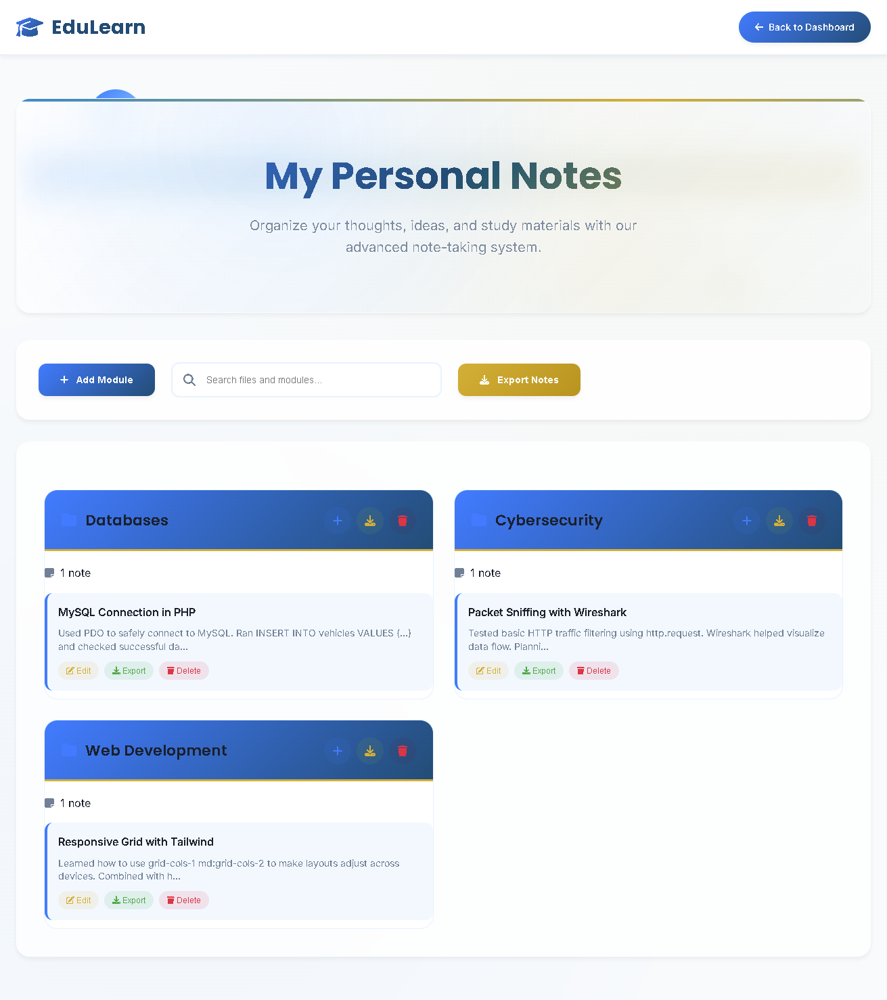
<p align="center"><em>📝 Système de prise de notes avancé</em></p>
</td>
<td width="50%">
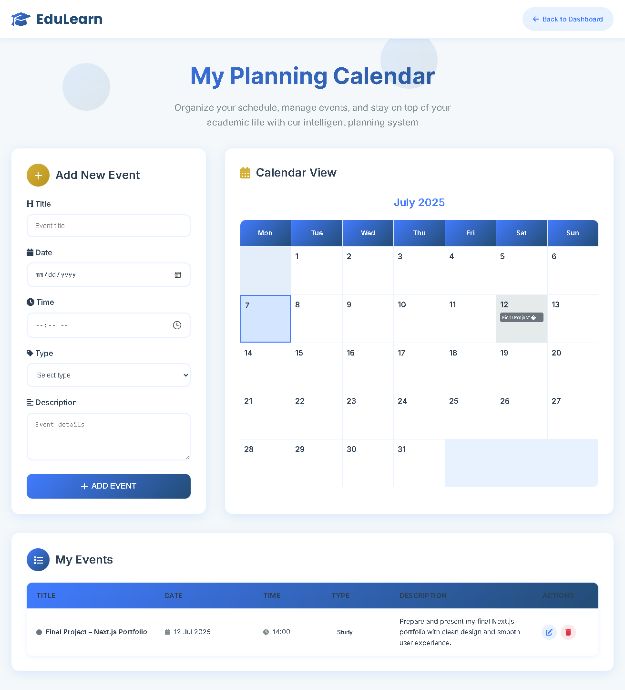
<p align="center"><em>📅 Centre de planification personnelle</em></p>
</td>
</tr>
</table>

### 🎛️ **Panneau d'administration - Suite de gestion complète**
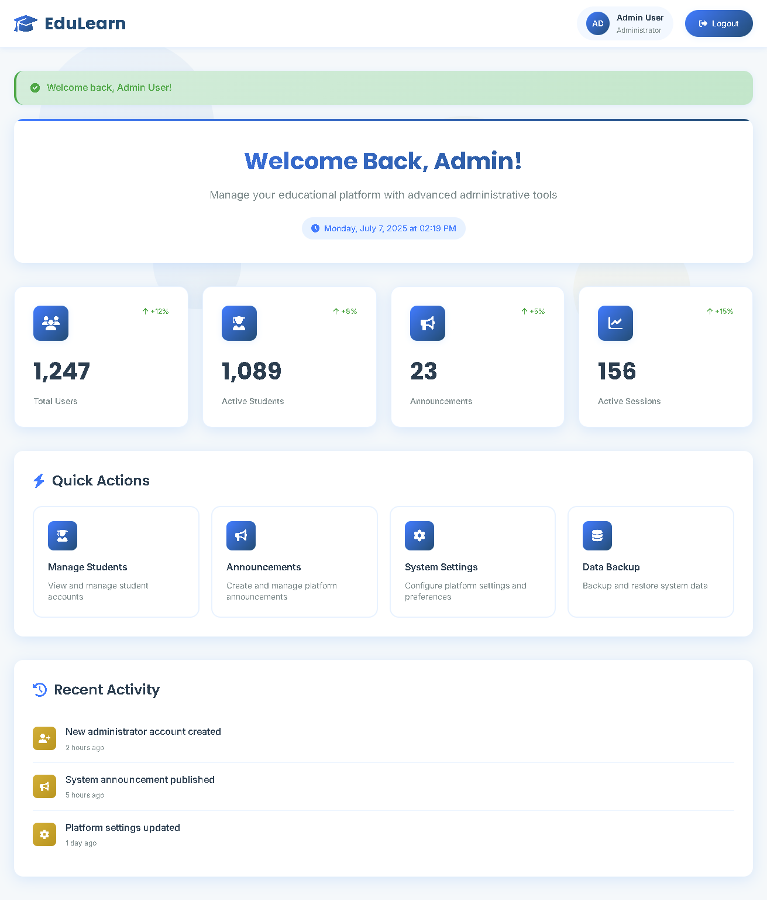

### 🛠️ **Fonctionnalités administratives**
<table>
<tr>
<td width="33%">
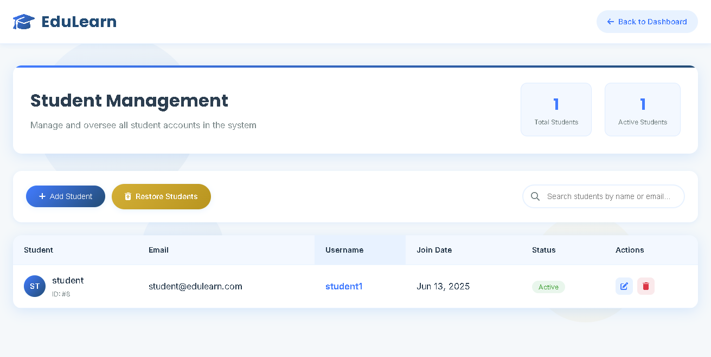
<p align="center"><em>👥 Gestion des étudiants</em></p>
</td>
<td width="33%">
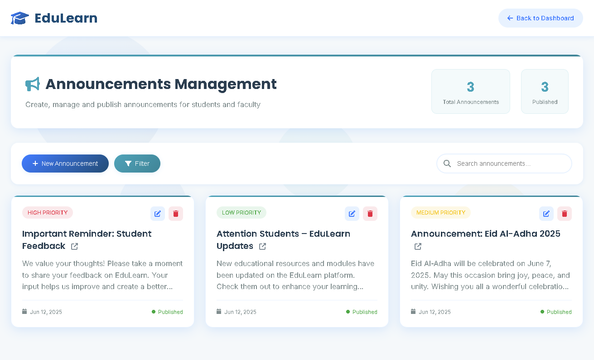
<p align="center"><em>📢 Système d'annonces</em></p>
</td>
<td width="33%">
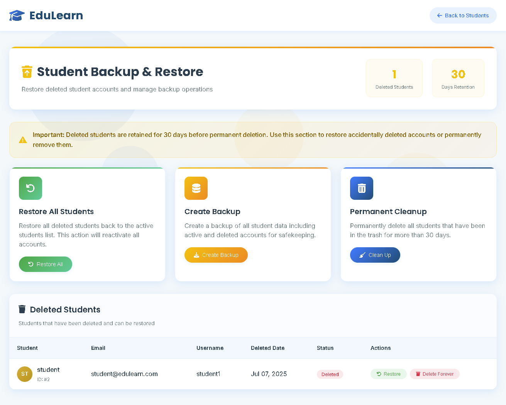
<p align="center"><em>💾 Gestion des sauvegardes</em></p>
</td>
</tr>
</table>

---

## 🚀 Installation Rapide

### 📋 Prérequis
- PHP 8.0+
- MySQL 8.0+
- XAMPP/WAMP (recommandé)
- Clé API Google Gemini

### ⚡ Étapes d'installation

```bash
# 1. Cloner le repository
git clone https://github.com/Mohammed-ES/EduLearn_Platform.git
cd EduLearn_Platform

# 2. Configuration de l'environnement
cp .env.example .env

# 3. Configurer la base de données
mysql -u root -p < database/edulearn_db.sql

# 4. Démarrer le serveur web (XAMPP/WAMP)
# Accéder à : http://localhost/EduLearn
```

### 🔧 Configuration

Éditez le fichier `.env` avec vos configurations :

```env
# Configuration Base de données
DB_HOST=localhost:3307
DB_USER=root
DB_PASS=your_password
DB_NAME=edulearn_db

# Configuration Gemini AI
GEMINI_API_KEY=your_gemini_api_key
GEMINI_MODEL=gemini-2.0-flash
```

---

## 🛠️ Technologies Utilisées

<div align="center">


</div>

---

## 📱 Guide d'utilisation

### 👨‍🎓 Pour les étudiants
1. **S'inscrire/Se connecter** → Créer un compte ou se connecter
2. **Tableau de bord** → Accéder à votre dashboard personnalisé
3. **Prendre des notes** → Créer et organiser vos notes d'étude
4. **Générer des quiz** → Utiliser l'IA pour créer des quiz sur n'importe quel sujet
5. **Planifier** → Organiser votre emploi du temps d'étude
6. **Assistant IA** → Obtenir de l'aide pour vos études

### 👨‍💼 Pour les administrateurs
1. **Panneau admin** → Accéder aux fonctionnalités de gestion avancées
2. **Gestion des utilisateurs** → Ajouter, modifier ou supprimer des étudiants
3. **Gestion du contenu** → Gérer les annonces et ressources
4. **Analytics** → Voir les analyses détaillées de la plateforme

---

## 🔐 Fonctionnalités de sécurité

- ✅ **Variables d'environnement** : Données sensibles stockées dans `.env`
- ✅ **Requêtes préparées** : Prévention des injections SQL
- ✅ **Validation des entrées** : Assainissement complet des données
- ✅ **Sécurité des sessions** : Gestion sécurisée des sessions
- ✅ **Contrôle d'accès** : Permissions basées sur les rôles
- ✅ **Protection XSS** : Encodage des sorties

---

## 🤝 Contribution

<div align="center">

[](https://github.com/Mohammed-ES/EduLearn_Platform/blob/main/CONTRIBUTING.md)
[](https://github.com/Mohammed-ES/EduLearn_Platform/issues)

</div>

1. **Fork** le repository
2. **Créer** une branche feature (`git checkout -b feature/NouvelleFonctionnalite`)
3. **Commit** vos changements (`git commit -m 'Ajouter une nouvelle fonctionnalité'`)
4. **Push** vers la branche (`git push origin feature/NouvelleFonctionnalite`)
5. **Ouvrir** une Pull Request

---

<div align="center">

### 🚀 **Prêt à transformer l'éducation ?**

**[⭐ Star ce repository](https://github.com/Mohammed-ES/EduLearn_Platform)** • **[🍴 Fork le](https://github.com/Mohammed-ES/EduLearn_Platform/fork)**

**Créé avec ❤️ par [Mohammed ES](https://github.com/Mohammed-ES)**

### 🎯 **EduLearn : Là où la technologie rencontre l'éducation**

*Responsabiliser les apprenants, permettre aux éducateurs, transformer l'avenir.*

</div>


